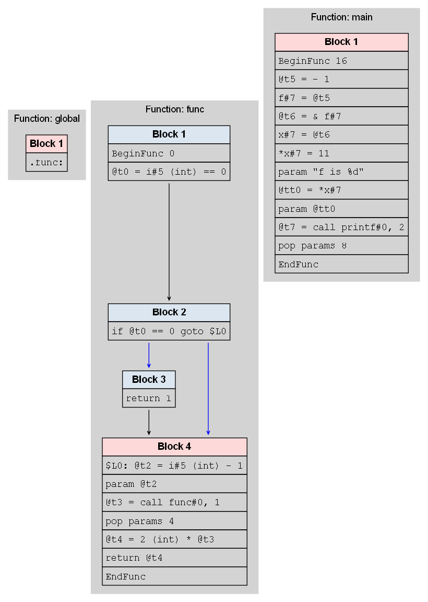

# Compiler-CSN352: A Comprehensive C-like Language Compiler

## Project Overview

This compiler project implements a full-featured compiler for a C-like language, developed as a course project for CSN352: Compiler Design at IIT Roorkee. The compiler provides a comprehensive approach to source code processing through multiple compilation stages.

## Compilation Stages

### 1. Preprocessor Stage (cpp.py)

**Output**: Pre-Processed Code

- Macro Preprocessing Support
  - Object-like macros
  - Function-like macros
  - Macro expansion
  - Conditional compilation directives (`#ifdef`, `#ifndef`, `#define`, `#undef`)
- Standard library file reference validation
- Directive parsing and preprocessing
- Preliminary error detection
- Note: No full linking implemented at this stage

**Output Example:**

> ```
> Preprocessed: ff84274d-67f4-42f7-bd98-394db3e29328.c
> ╔══════════ File Contents ══════════╗
> ║ void print_int(int x);            ║
> ║ void print_float(float x);        ║
> ║ void print_char(char x);          ║
> ║ void print_string(const char *s); ║
> ║                                   ║
> ║ enum Color {TRUE, FALSE};         ║
> ║ int main() {                      ║
> ║     int* x;                       ║
> ║     int y = *x;                   ║
> ║ }                                 ║
> ╚═══════════════════════════════════╝
> Parsing file: C:\Users\mailg\AppData\Local\Temp\tmpaic2idcm.c
> ```

### 2. Lexical Analysis Stage
**Output**: Token Stream
- Tokenizes source code into meaningful components
- Supports complex lexical features:
  - Bitwise, Logical, Relational Operators
  - Arithmetic and Assignment Operators
  - Comment Handling (Multi-line and Single-line)
  - Error Detection with Line and Position Reporting

### 3. Syntax Analysis Stage
**Output**: Parse Tree
- Generates a visual Syntax Tree
- Validates program structure
- Supports advanced C language constructs

**Parse Tree Example:**


### 4. Semantic Analysis Stage
**Output**: 
- Scope Tree
- Symbol Table with Detailed Information

**Advanced Semantic Analysis Features:**
- Type Checking and Validation
  - Strict type compatibility checks
- Scope Management
  - Nested scope handling
  - Block-level scope tracking
- Advanced Type Support
  - Structs with nested fields
  - Unions with type-punning support
  - Enum type validation
- Function Semantics
  - Recursive function detection and validation
  - Variable argument function support (ellipsis)
  - Function pointer semantics
- Memory and Pointer Semantics
  - Pointer arithmetic validation
  - Multi-level pointer type checking
  - Dynamic memory allocation semantic checks
- Advanced Language Constructs
  - Static variable semantics
  - Const qualifier handling
  - Typedef semantic validation
  - Command Line Input

**Symbol Table Example:**
```
+--------------+-------------+-----------+---------+-------------+--------+----------+
| Name         | Type        | Kind      |   Scope | ScopeName   |   Size |   Offset |
+==============+=============+===========+=========+=============+========+==========+
| fun          | int         | function  |       0 | global      |      0 |        0 |
+--------------+-------------+-----------+---------+-------------+--------+----------+
| i            | int         | parameter |       1 | block@1     |      4 |        0 |
+--------------+-------------+-----------+---------+-------------+--------+----------+
| _VAR_ARGS_   | ...         | parameter |       1 | block@1     |        |        0 |
+--------------+-------------+-----------+---------+-------------+--------+----------+
| main         | int         | function  |       0 | global      |      0 |        0 |
+--------------+-------------+-----------+---------+-------------+--------+----------+
| a            | int         | variable  |       1 | block@1     |      4 |        0 |
+--------------+-------------+-----------+---------+-------------+--------+----------+
| x            | *int        | variable  |       1 | block@1     |      8 |        4 |
+--------------+-------------+-----------+---------+-------------+--------+----------+
| z            | int         | variable  |       1 | block@1     |      4 |       12 |
+--------------+-------------+-----------+---------+-------------+--------+----------+
```
**Scope Tree Example:**


### 5. IR Generation (3AC)

**Output of IR Stage**: 
- Three Address Code Intermediate Representation
- Visual Representation in form of IR-Tree to understand the data flow of code generation

**Advanced Supported Features**
- Implicit and Explicit Type Conversion
- Variable Arguments
- Multidimensional array access and declaration
- Multilevel pointer and dereferencing
- Struct/Union Access using DOT and -> operators
- Enumerators
- typedef
- Operators with types
- Recursion
- CLI
- Until Loops

**Example Output**

```assembly
.fun:
    BeginFunc
    return 11
    EndFunc

.main:
    BeginFunc
    a = 11
    @t0 = & a
    x = @t0
    @t1 = charToint 'a'
    z = @t1
    param z
    param a
    @t2 = call fun, 2
    EndFunc
```


### 6. ASM Generation (x86)

**Output of ASM Stage**: 
- Assembly Code that can run on your hardware
- Visual Representation of Control Flow Graphs

**Advanced Supported Features**
- Multidimensional array access and declaration
- Multilevel pointer and dereferencing
- Struct/Union Access using DOT and -> operators
- Enumerators
- typedef
- References
- Recursion
- Until Loops

**Example Output**

```assembly
section .text
global _start
extern printf
extern scanf
extern malloc
extern free
extern exit
; Function _start
_start:
	and rsp, -16
	call main
	mov rdi, rax
	call exit
; Function func
func:
	push rbp
	mov rbp, rsp
	sub rsp, 32
	mov dword [rbp-4], edi
	cmp dword [rbp-4], 0
	sete r15b
	movzx r15d, r15b
	mov dword [rbp-8], r15d
	mov dword [rbp-8], r15d
	cmp dword [rbp-8], 0
	je $L0
	mov rax, 1
jmp $endfunc
$L0:
	mov r15d, dword [rbp-4]
	sub r15d, 1
	mov dword [rbp-12], r15d
	mov dword [rbp-12], r15d
	push rax
	push rcx
	push rdx
	push rsi
	push rdi
	push r8
	push r9
	push r10
	push r11
	sub rsp, 8
	mov edi, dword [rbp-12]
	call func
	mov dword [rbp-16], eax
	add rsp, 8
	pop r11
	pop r10
	pop r9
	pop r8
	pop rdi
	pop rsi
	pop rdx
	pop rcx
	pop rax
	mov r15d, dword [rbp-16]
	imul r15d, 2
	mov dword [rbp-20], r15d
	mov dword [rbp-20], r15d
	mov eax, dword [rbp-20]
jmp $endfunc
$endfunc:
	leave
	ret
; Function main
main:
	push rbp
	mov rbp, rsp
	sub rsp, 48
	mov r15d, dword [rbp-20]
	mov dword [rbp-4], r15d
	mov dword [rbp-20], r15d
	lea r15, [rbp-4]
	mov qword [rbp-28], r15
	mov qword [rbp-28], r15
	mov r15, qword [rbp-28]
	mov qword [rbp-16], r15
	mov qword [rbp-28], r15
	mov r15, qword [rbp-16]
	mov qword [r15], 11
	mov qword [rbp-16], r15
	push rax
	push rcx
	push rdx
	push rsi
	push rdi
	push r8
	push r9
	push r10
	push r11
	sub rsp, 8
	mov rdi, str0
	mov r15, qword [rbp-16]
	mov r14, qword [r15]
	mov dword [rbp-32], r14d
	mov qword [rbp-16], r15
	mov esi, dword [rbp-32]
	call printf
	mov dword [rbp-36], eax
	add rsp, 8
	pop r11
	pop r10
	pop r9
	pop r8
	pop rdi
	pop rsi
	pop rdx
	pop rcx
	pop rax
$endmain:
	leave
	ret

section .data
str0 db "f", " ", "i", "s", " ", "%", "d", 0
```

# Control Flow Graph:



## Quick Start

### Prerequisites
- Python 3.9+
- Install dependencies: `pip install -r requirements.txt`
- Optional: PyPy3 for JIT compilation

### Running the Compiler

#### Preparing Execution Scripts
If `run.sh` doesn't have execute permissions:
```bash
# Make the script executable
chmod +x run.sh

# Alternative for specific file
chmod u+x run.sh   # Give user execute permission
chmod a+x run.sh   # Give all users execute permission
```

#### Standard Execution
```bash
# Linux
./run.sh
followed by ./test.sh

# Windows
run.bat
```

#### Fast Compilation (JIT)
```bash
# Requires PyPy3 installed
./run.sh --fast
```

### Command Line Options
- `-h`: Help
- `-g`: Render Parse Trees
- `--fast`: Enable JIT Compilation
- `-d` to choose an entire directory of test cases to run the compiler
- `--no-ir` to disable IR Generation

## Project Structure
```
compiler-project/
├── main.py                  # Entry point
├── src/                     # Source code
│   ├── cpp.py               # Preprocessor
│   ├── lexer.py             # Lexical Analyzer
│   ├── parser.py            # Syntax Analyzer
│   ├── symtab.py            # Symbol Table Generator
│   └── ...
├── testcases/               # Test C files
├── tests/                   # Comprehensive Test Suites
│   ├── small/               # Small test cases
│   └── large/               # Large test cases
└── renderedTrees/           # Generated parse trees
```

## Technologies
- Python
- PLY (Python Lex-Yacc)
- Graphviz
- Rich (For Pretty Tables)
- CryptoHash (Used to generate hashes for stress testing)
- Optional: PyPy3 for JIT (Useful for large or many files)

## Known Issues and Contributions

### Semantic Bugs
- Detailed semantic bugs are tracked in `todo.md`
- Community contributions welcome!

### How to Contribute
1. Check `todo.md` for known issues
2. Raise issues on the GitHub repository
3. Submit pull requests with fixes or improvements

## Team Members
| Name           | Enrollment No. |
| -------------- | -------------- |
| Garv Sethi     | 22115057       |
| Granth Gaud    | 22114035       |
| Swapnil Garg   | 22115150       |
| Mmukul Khedekar| 22114054       |
